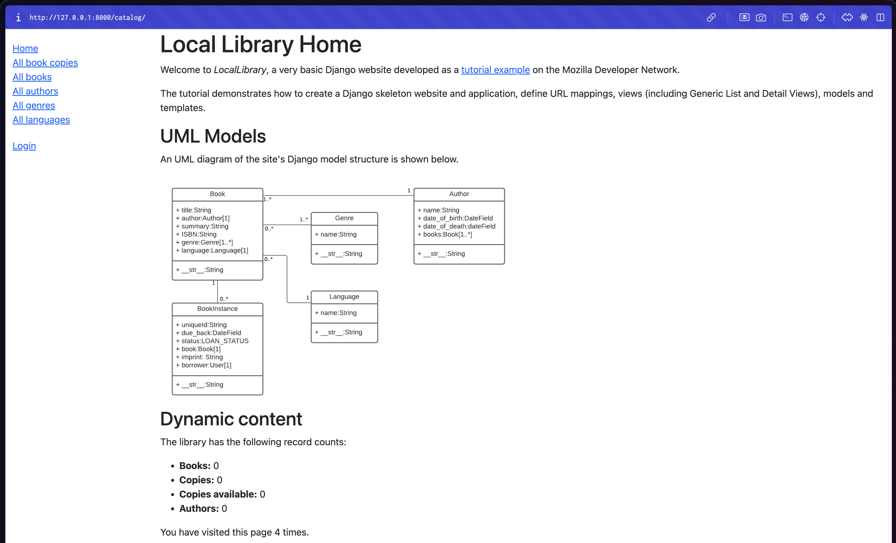
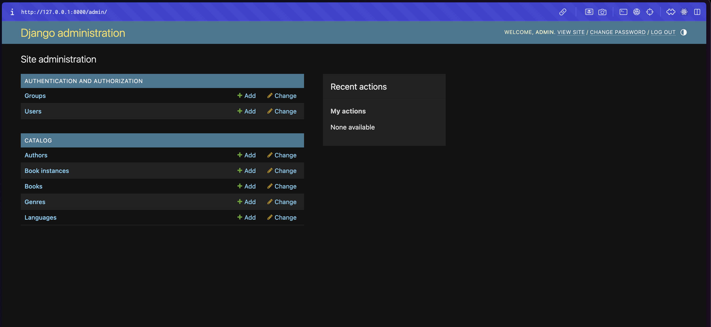
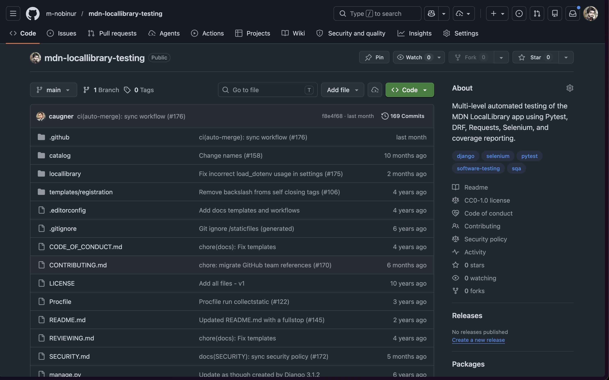

# Phase 1 Evidence - Clean Start and Baseline Setup

## Result summary

- Environment setup completed from a clean state
- Application baseline verified after dependency installation and migrations
- Admin access and repository setup confirmed

## Verification checklist

- Created the local environment with `uv venv .venv`
- Installed runtime dependencies from `requirements.txt`
- Applied Django migrations successfully
- Created a superuser account
- Verified the public catalogue page, admin dashboard, and GitHub repository state

## Evidence files

- [home-page.png](home-page.png) - Public catalogue page loads successfully
- [admin-dashboard.png](admin-dashboard.png) - Django admin access works after superuser setup
- [github-repo.png](github-repo.png) - Public repository setup state

## Home page view

## Admin dashboard view

## GitHub repository view

