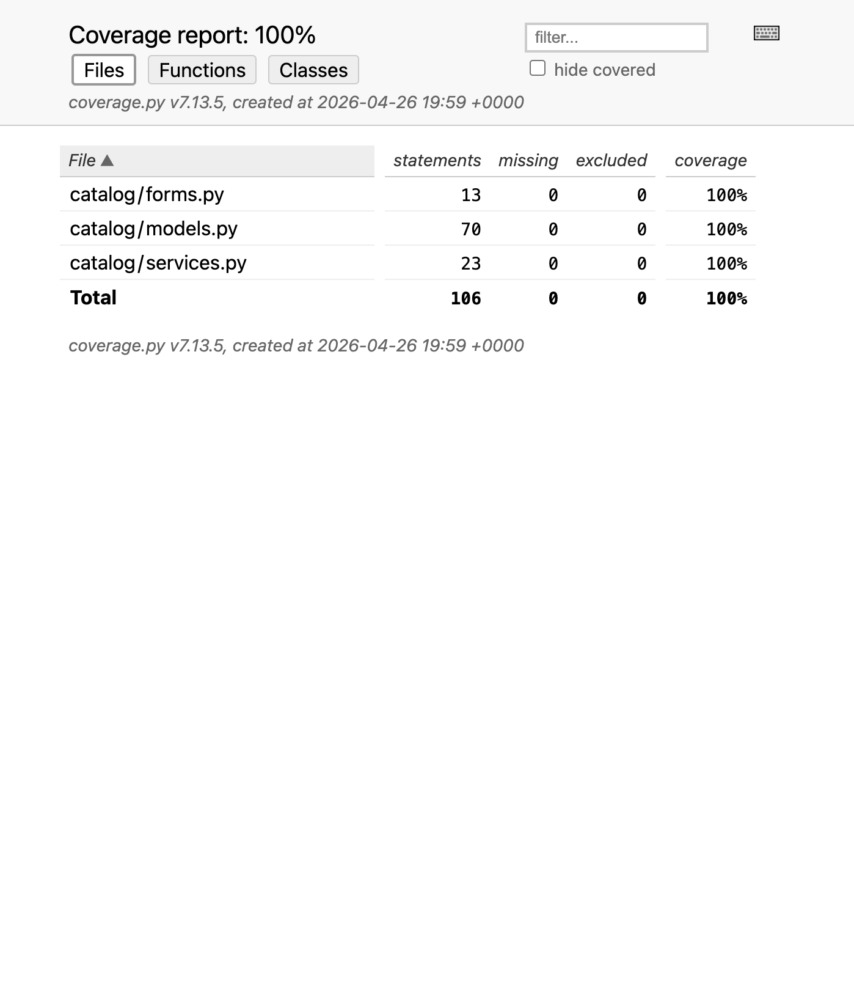
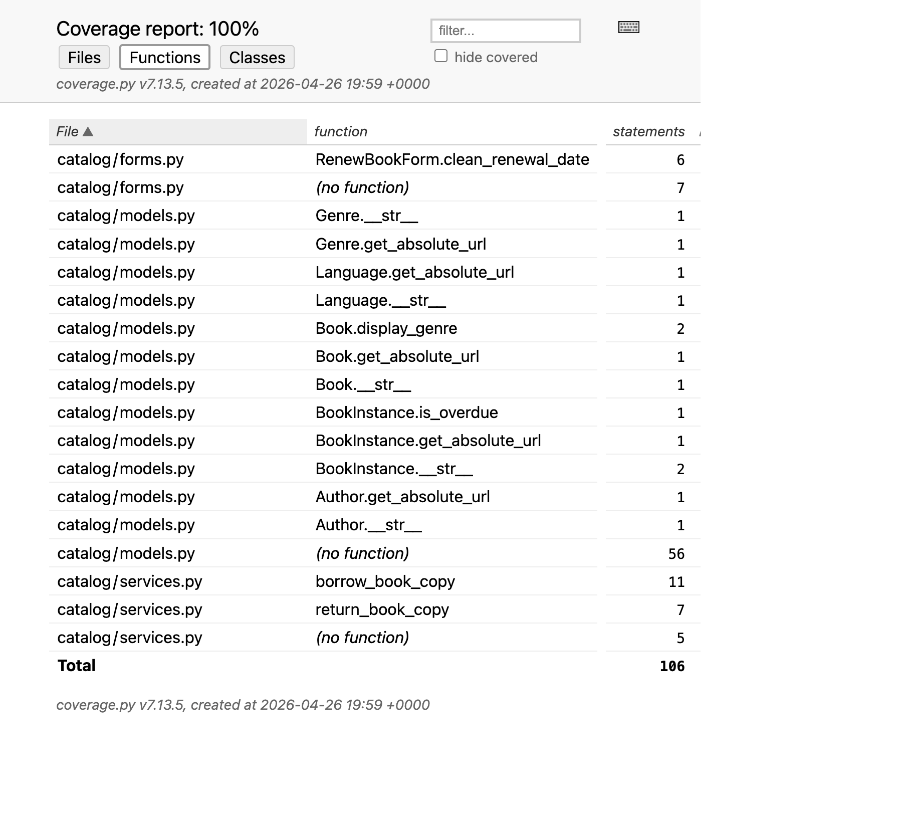
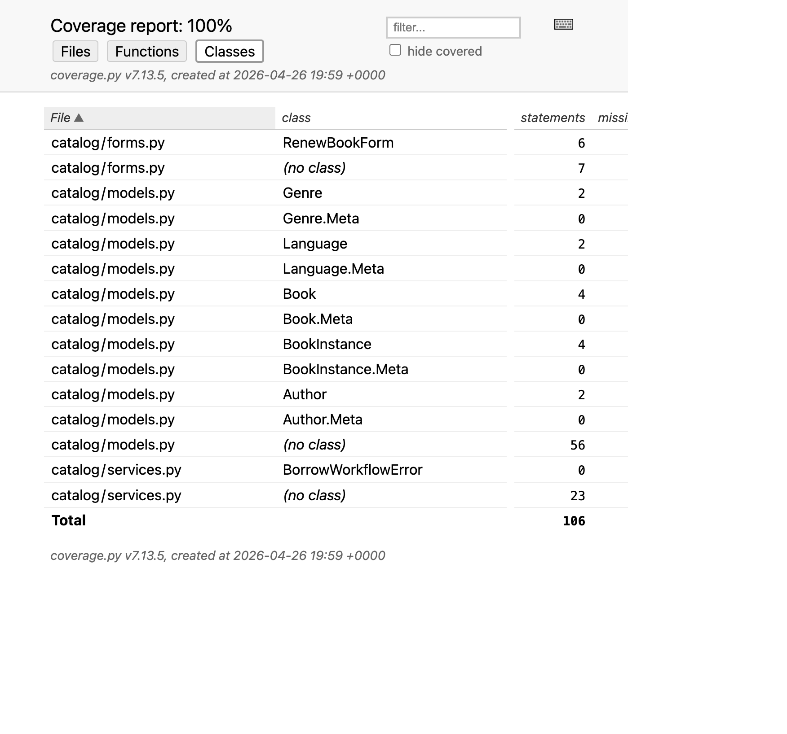
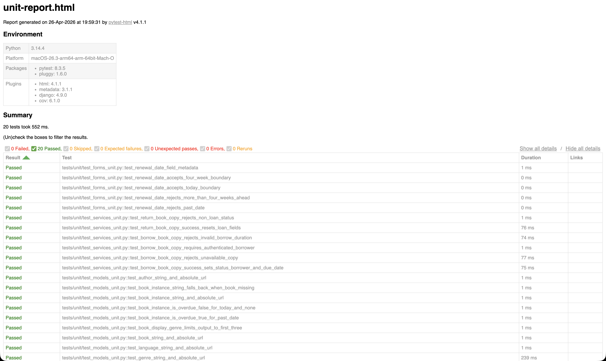

# Phase 4 Evidence - Unit Testing and Coverage Foundation

## Command executed

```bash
.venv/bin/python -m pytest -m unit \
  --cov=catalog.forms \
  --cov=catalog.models \
  --cov=catalog.services \
  --cov-report=term-missing \
  --cov-report=html:reports/coverage-html \
  --html=reports/unit-report.html \
  --self-contained-html
```

## Result summary

- Test outcome: `20 passed`
- Coverage:
  - `catalog/forms.py`: `100%`
  - `catalog/models.py`: `100%`
  - `catalog/services.py`: `100%`

## Evidence files

- [coverage-files-overview.png](coverage-files-overview.png) - Coverage HTML files summary view
- [coverage-functions-overview.png](coverage-functions-overview.png) - Coverage HTML functions view
- [coverage-classes-overview.png](coverage-classes-overview.png) - Coverage HTML classes view
- [unit-report-overview.png](unit-report-overview.png) - Pytest HTML unit report
- [Unit report (HTML)](../../../reports/unit-report.html)

## Coverage files view



## Coverage functions view



## Coverage classes view



## Unit report view


