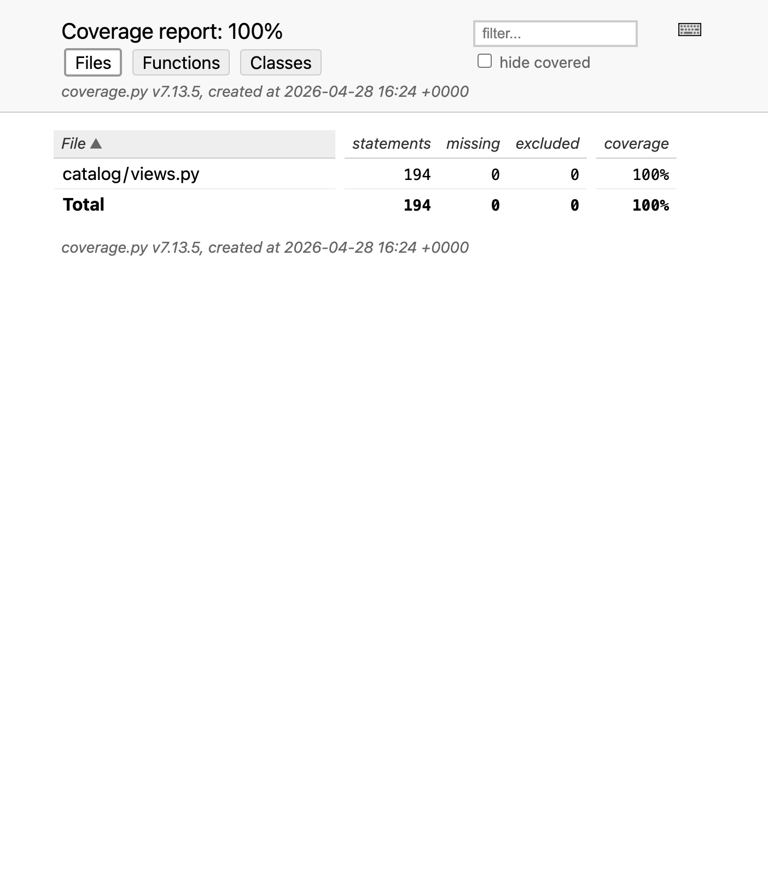
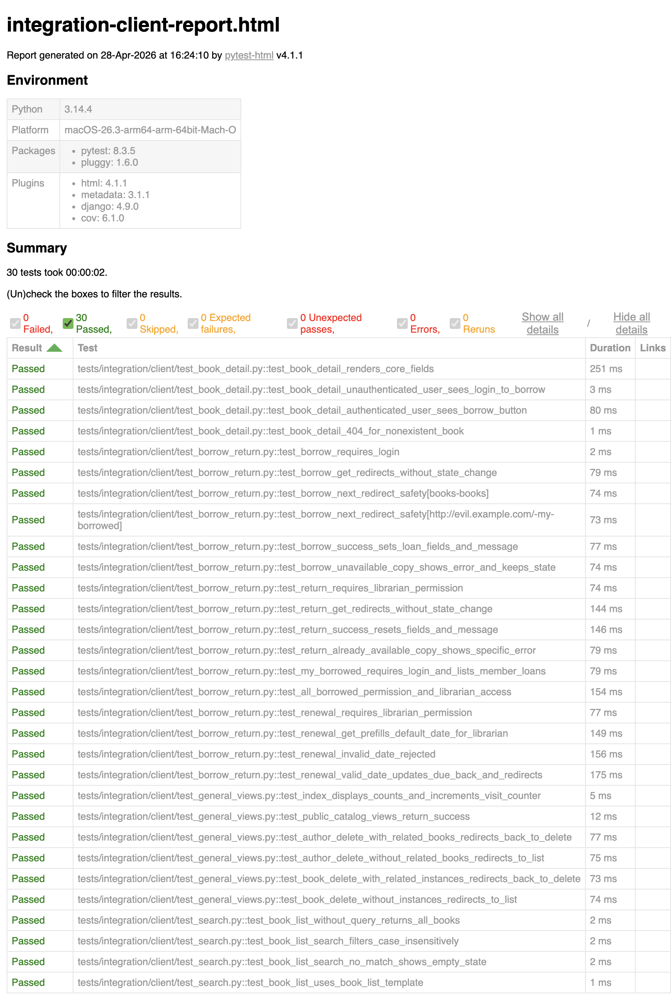

# Phase 5 Evidence - Django Client Integration Testing

## Command executed

```bash
.venv/bin/python -m pytest -m integration_client \
  --cov=catalog.views \
  --cov-report=term-missing \
  --cov-report=html:reports/coverage-integration-html \
  --html=reports/integration-client-report.html \
  --self-contained-html \
  -q
```

## Result summary

- Test outcome: `30 passed`
- Coverage:
  - `catalog/views.py`: `100%` (`194 statements, 0 missing`)

## Test file breakdown

| File | Tests | Scope |
| ----- | ----- | ----- |
| `tests/integration/client/test_search.py` | 4 | Book list search/filter behavior |
| `tests/integration/client/test_book_detail.py` | 4 | Book detail rendering and borrow UI |
| `tests/integration/client/test_borrow_return.py` | 16 | Borrow/return workflows, borrowed lists, renewal |
| `tests/integration/client/test_general_views.py` | 6 | Index, public catalog views, delete branches |
| **Total** | **30** | |

## Coverage report



## Integration report view


