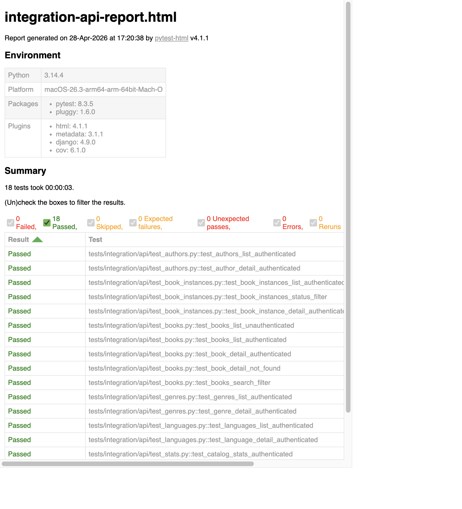
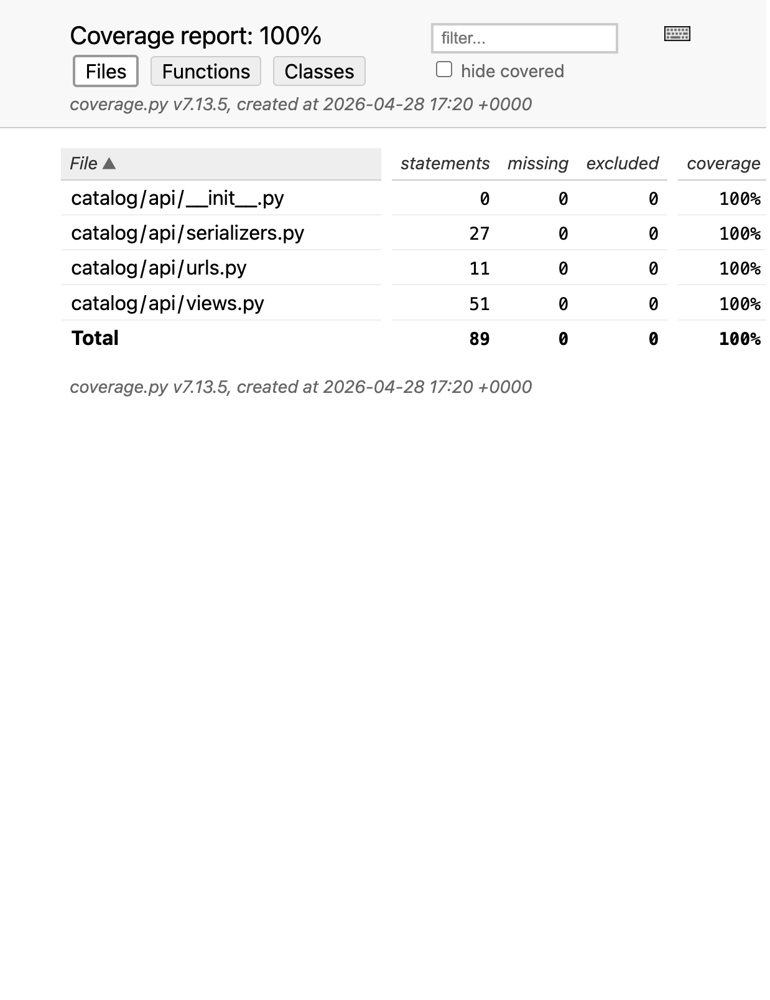

# Phase 6 Evidence - Requests-Based API Integration Testing

## Commands executed

```bash
.venv/bin/python -m pytest -m integration_api \
  --html=reports/integration-api-report.html \
  --self-contained-html \
  -q

.venv/bin/python -m pytest -m integration_api \
  --cov=catalog.api \
  --cov-report=term-missing \
  --cov-report=html:reports/coverage-integration-api-html \
  -q
```

## Result summary

- Test outcome: `18 passed` (`0 failed`, `0 skipped`)
- API coverage (`catalog.api`): `100%`
  - `catalog/api/serializers.py`: `100%`
  - `catalog/api/urls.py`: `100%`
  - `catalog/api/views.py`: `100%`

## Test file breakdown

| File | Tests | Scope |
| ----- | ----- | ----- |
| `tests/integration/api/test_token_auth.py` | 2 | Token auth success/failure |
| `tests/integration/api/test_books.py` | 5 | Unauthenticated rejection, list/detail, search filter, 404 |
| `tests/integration/api/test_authors.py` | 2 | Authors list and detail payload |
| `tests/integration/api/test_book_instances.py` | 3 | List/detail payload and `?status=` filter |
| `tests/integration/api/test_genres.py` | 2 | Genres list and detail payload |
| `tests/integration/api/test_languages.py` | 2 | Languages list and detail payload |
| `tests/integration/api/test_stats.py` | 2 | Stats authenticated and unauthenticated behavior |
| **Total** | **18** | |

## Evidence files

- [integration-api-report.png](integration-api-report.png) - Pytest HTML integration API report overview
- [coverage-integration-api-summary.png](coverage-integration-api-summary.png) - Coverage HTML summary for `catalog.api`
- [Integration API report (HTML)](../../../reports/integration-api-report.html)
- [Coverage report (HTML)](../../../reports/coverage-integration-api-html/index.html)

## Integration API report view



## Coverage report view


