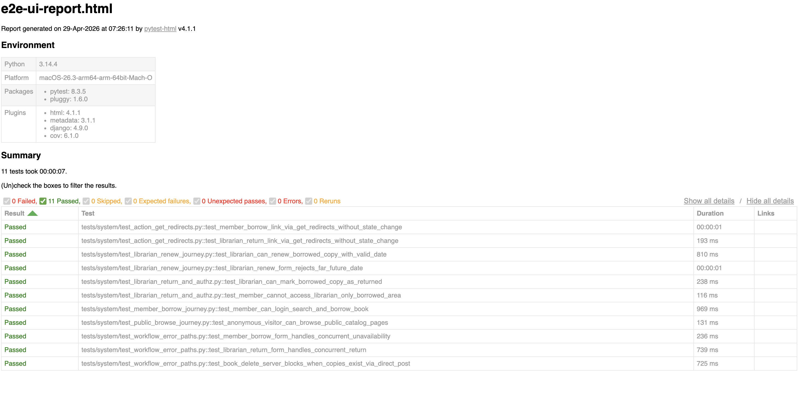

# Phase 7 Evidence - Browser E2E UI Testing

## Commands executed

```bash
RUN_SYSTEM_TESTS=1 .venv/bin/python -m pytest -m e2e_ui \
  --html=reports/e2e-ui-report.html \
  --self-contained-html \
  -q

RUN_SYSTEM_TESTS=1 .venv/bin/python -m pytest -m e2e_ui \
  --cov=catalog.views \
  --cov-report=term-missing \
  --cov-report=html:reports/coverage-e2e-ui-html \
  -q
```

## Result summary

- E2E UI journey outcome: `11 passed` (`0 failed`, `0 skipped`)
- Coverage scope: `catalog/views.py`
- Coverage result: `97%` (`194 statements`, `5 missing`)
- Remaining miss: `AuthorDelete.form_valid` `RestrictedError` branch (lines 261-265), already covered at the integration-client level (`REQ-WF-018`).

## Generated artifacts

- `reports/e2e-ui-report.html`
- `reports/coverage-e2e-ui-html/index.html`

## Test file breakdown

| File | Tests | Scope |
| ----- | ----- | ----- |
| `tests/system/test_member_borrow_journey.py` | 1 | Member login, search, borrow, and borrowed-list verification |
| `tests/system/test_librarian_return_and_authz.py` | 2 | Librarian return journey and member forbidden-access scenario |
| `tests/system/test_public_browse_journey.py` | 1 | Anonymous browse across home, books, book detail, authors, genres, languages |
| `tests/system/test_librarian_renew_journey.py` | 2 | Librarian renew with valid date plus far-future-date validation re-render |
| `tests/system/test_action_get_redirects.py` | 2 | Borrow/return action endpoints redirect non-POST browser navigations |
| `tests/system/test_workflow_error_paths.py` | 3 | Concurrent borrow/return error flashes plus direct-POST defense for book delete |
| **Total** | **11** | |

## Coverage report



## Browser and WebDriver setup used

- Browser automation package: `selenium==4.25.0`
- Browser runtime: Chrome
- Driver resolution: Selenium Manager (bundled with Selenium 4)
- Test execution mode: headless by default (`SYSTEM_TEST_HEADLESS=1`)
- Headed option:
  - `SYSTEM_TEST_HEADLESS=0` runs Chrome with a visible window
