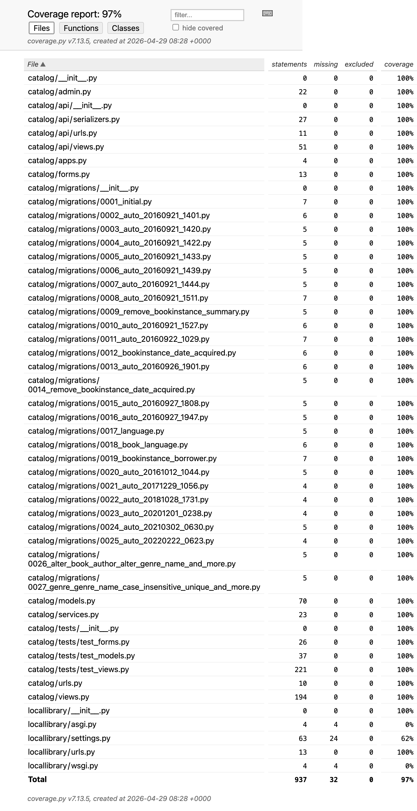
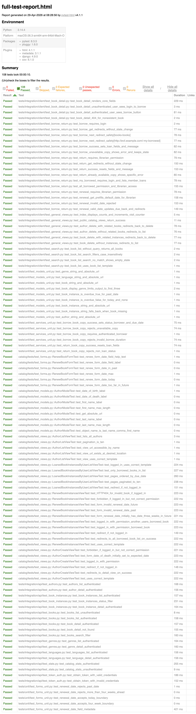

# Phase 8 Evidence - Consolidated Coverage and Maximum Coverage Push

## Commands executed

```bash
.venv/bin/python -m pytest -m "not system" \
  --cov=catalog --cov=locallibrary \
  --cov-report=term-missing \
  --cov-report=html:reports/coverage-html \
  --cov-report=xml:reports/coverage.xml \
  --html=reports/full-test-report.html \
  --self-contained-html \
  -q

.venv/bin/python -m pytest -m "not e2e_ui" \
  --cov=catalog --cov=locallibrary \
  --cov-report=term-missing \
  --cov-report=html:reports/coverage-html \
  --cov-report=xml:reports/coverage.xml \
  --html=reports/full-test-report.html \
  --self-contained-html \
  -q
```

## Result summary (2026-04-29)

- Consolidated coverage run (`not system`): `108 passed`, `11 skipped`
- Marker-aligned verification run (`not e2e_ui`): `108 passed`, `11 deselected`
- Overall combined coverage (`catalog` + `locallibrary`): `97%` (`937 statements`, `32 missing`)

### Target verification

| Area | Target | Achieved |
| --- | --- | --- |
| Core app logic | 90%+ | 100% |
| Services and API | 95-100% | 100% |
| Forms | 100% | 100% |
| Views | 90%+ | 100% |

### Module highlights

- `catalog/forms.py`: `100%`
- `catalog/models.py`: `100%`
- `catalog/services.py`: `100%`
- `catalog/views.py`: `100%`
- `catalog/api/*`: `100%`

## Coverage report



## Full test report


